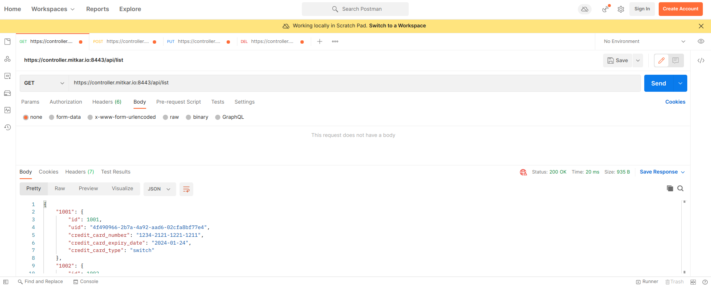
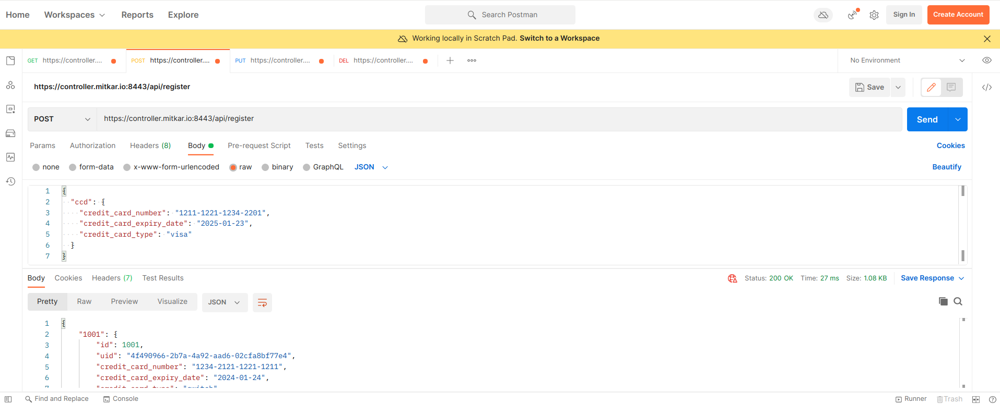
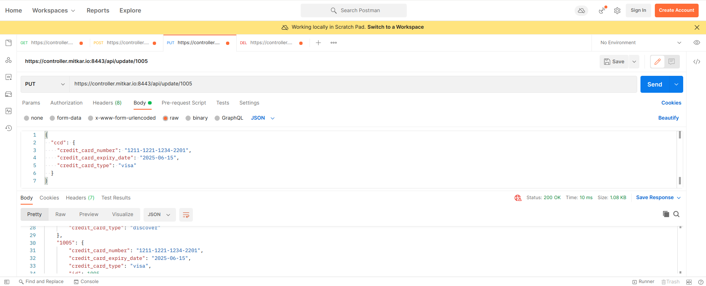
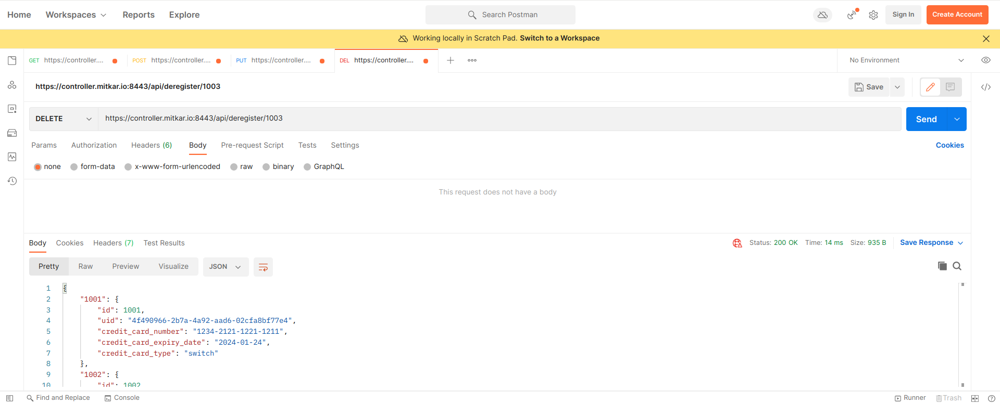

# Postman
---
Website : [Postman](https://www.postman.com/)


#### What is Postman?
Postman is an API platform for building and using APIs. Postman simplifies each step of the API lifecycle and streamlines collaboration so you can create better APIs—faster.
### Installation
---
```bash
sudo snap install postman
```
### Start Postman
---
```bash
postman
```
### Example Screenshots
---
#### GET
```bash
https://controller.mitkar.io:8443/api/list
```

#### POST
```bash
https://controller.mitkar.io:8443/api/register
```
`body`:
```
{
  "ccd": {
    "credit_card_number": "1211-1221-1234-2201",
    "credit_card_expiry_date": "2025-01-23",
    "credit_card_type": "visa"
  }
}
```

#### PUT
```bash
https://controller.mitkar.io:8443/api/update/1005
```
`body`:
```
{
  "ccd": {
    "credit_card_number": "1211-1221-1234-2201",
    "credit_card_expiry_date": "2025-06-15",
    "credit_card_type": "visa"
  }
}
```

#### DELETE
```bash
https://controller.mitkar.io:8443/api/deregister/1003
```

